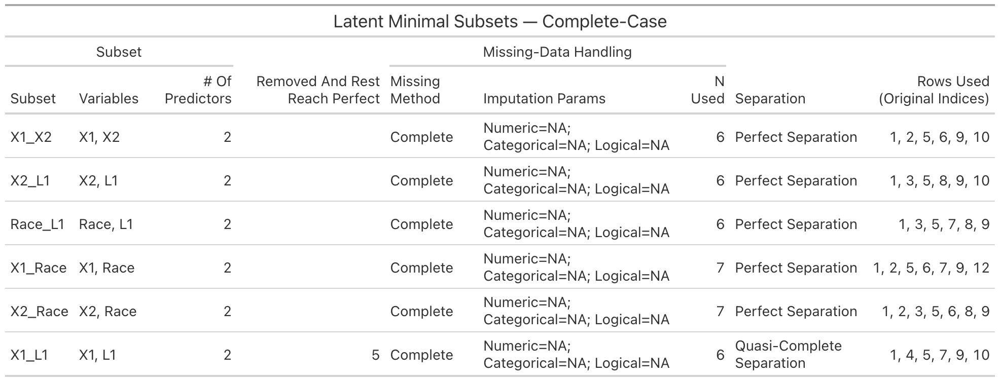

# DISCO
**DI**agnosis of **S**eparation and **C**orrection of **O**dds-ratio inflation in logistic regression

> Fast diagnostics for **perfect** and **quasi-complete** separation in binary outcomes, with clear severity scoring, per-subset missing-data handling, and pretty `gt` tables.

---

## Why separation matters
When predictors **perfectly** (or almost perfectly) split the outcome, logistic regression can produce **infinite** (or severely inflated) odds ratios and unstable inference. **DISCO** helps you **detect** these cases early and (soon) **correct** estimates.

---

## Overview

### Separation Diagnosis
- `uni_separation()` — univariate detector using:
  - Hungarian matching to align clusters,
  - a **vectorized Rand index**,
  - a **non-negative boundary threshold** to guard against boundary ties,
  - a **continuous severity score** in \[0,1\].
- `latent_separation()` — multivariate detector using **LP-based** feasibility with options to:
  - search for **inclusion-minimal** separating subsets (pruning),
  - choose **perfect**, **quasi**, or **either** as “hit” criteria,
  - handle missingness **per subset** (complete-case or imputation).

### Estimation Correction
Planned: odds-ratio deflation after separation detection. *(Coming soon.)*

---

## Installation

```r
# install.packages("devtools")
devtools::install_github("bioscinema/DISCO")
library(DISCO)
```

## Separation Diagnosis
### Quick Start

```r
library(DISCO)

# Univariate: quick diagnostic
df <- data.frame(Y = c(0,1,0,1), X = c(-2, 2, -1, 1))
res <- uni_separation(df, predictor = "X", outcome = "Y", missing = "complete")
res$separation_type     # "Perfect separation" | "Quasi-complete separation" | "No separation problem"
res$severity_score      # in [0,1]
res$boundary_threshold  # data-driven non-negative threshold
res$missing_info        # method, params, rows_used, n_used

# Latent (multivariate): LP-based check
y <- c(0,0,0,0,1,1,1,1)
X <- cbind(
  X1 = c(-1.86, -0.81, 1.32, -0.40, 0.91, 2.49, 0.34, 0.25),
  X2 = c( 0.52,  1.07, 0.60,  0.67,-1.39, 0.16,-1.40,-0.09)
)
latent_separation(y, X)$type  # "perfect separation" (for this example)
```

### Missing-Data Handling

- `missing = "complete"`: drop rows with **NA** in the tested variables; the **outcome is never imputed**.
- `missing = "impute"`: **impute predictors only**; outcome NAs are **always dropped**.
- Every result returns `missing_info` with:
  - `method` (`"complete"` or `"impute"`)
  - `params` (imputation settings or `custom_fn`)
  - `n_used` (number of rows analyzed after the missing-data rule)
  - `rows_used` (exact **original** row indices included in the fit)
- In latent (subset) searches, **each subset** has its own `missing_info` (its own `rows_used`/`n_used`) since missingness can differ by variable combination.

#### Imputation Params (`missing_info$params`)
A compact summary of per-type rules when `method = "impute"` (e.g., `Numeric=Mean; Categorical=Missing; Logical=Mode`):

- **Numeric** (`numeric_method`)
  - `Mean` — replace `NA` with the column mean  
  - `Median` — replace `NA` with the column median  
  - `Constant=<c>` — replace `NA` with a supplied constant (e.g., `Constant=0`)  
  - `Custom Imputer` — a user-provided function was used

- **Categorical** (`categorical_method`)
  - `Missing` — turn `NA` into an explicit `"Missing"` level (adds a level if needed)  
  - `Mode` — replace `NA` with the most frequent level  
  - `Constant=<level>` — replace `NA` with a supplied level  
  - `Custom Imputer` — a user-provided function was used

- **Logical** (`logical_method`)
  - `Mode` — replace `NA` with the most frequent value (`TRUE`/`FALSE`)  
  - `Constant=TRUE/FALSE` — replace `NA` with the given logical  
  - `Custom Imputer` — a user-provided function was used

**Mode definition.** *Mode* is the value/level occurring **most often** among non-missing entries. If there’s a tie, it is broken **deterministically** (e.g., first level / first in `table()` order).

Example with missing values:

```r
set.seed(2025)
df_miss <- data.frame(
  Y    = c(0,0,0,0,1,1,1,1, 0,1, NA, 1),
  X1   = c(0.5, 1.0, NA, 2.0, 5.0, 6.0, 7.0, NA, 1.5, 8.0, 9.0, 6.5),
  X2   = c(10, 9, 8, NA, 6, 5, NA, 3, 2, 1, 0, NA),
  Race = factor(c("A","A","B", NA, "C","C","B","A","B", NA, "C","A")),
  L1   = c(TRUE, NA, FALSE, TRUE, TRUE, NA, FALSE, TRUE, FALSE, TRUE, TRUE, NA)
)

# Complete-case
res_cc <- uni_separation(df_miss, "X1", "Y", missing = "complete")
res_cc$missing_info

# Impute (defaults = numeric median, categorical mode, logical mode)
res_imp <- uni_separation(df_miss, "X1", "Y", missing = "impute")
res_imp$missing_info

# Treat NA as a level for categorical predictors
res_cat <- uni_separation(
  df_miss, "Race", "Y", missing = "impute",
  impute_args = list(categorical_method = "missing")
)
res_cat$missing_info$params
```

### Pretty tables (gt) — optional

```r
# install.packages("gt")
library(gt)

# One predictor
res_uni_cc <- uni_separation(df_miss, "X1", "Y", missing = "complete")
gt_uni_separation(res_uni_cc, title = "Univariate (X1 vs Y) — Complete-case")

# All predictors vs outcome (one-shot summary)
gt_uni_separation_all(df_miss, outcome = "Y", missing = "complete")
```

### Example output


This table summarize univariate screen results of each predictor against the outcome (`Y`) using **complete-case** data. It flags whether any single predictor causes separation in a logistic model.

- **Predictor / Outcome**  
  The variable tested and the binary outcome.

- **Indices (block of columns)**
  - **Separation Index** — scaled 0–1; **1.000 = Perfect Separation**, values near 0 indicate no separation concern.
  - **Severity** — scaled 0–1 and shown with color; higher = more severe (red), lower = minimal/none (green).
  - **Boundary Threshold** — the univariate cut that separates classes at the boundary (reported for reference).
  - **Single-Tie Boundary** — **Yes** if separation hinges on a single boundary case; **No** otherwise.
  - **Tie Count** — number of tied boundary rows involved in the separating cut.

- **Missing-Data Handling (block of columns)**
  - **Missing Method** — *Complete* = complete-case analysis.
  - **Imputation Params** — parameters shown when imputation is used (here they’re placeholders because complete-case was used).
  - **N Used** — number of subjects actually analyzed after the missing-data rule.

- **Separation**  
  Text label summarizing the result:
  - **Perfect Separation** — predictor alone perfectly separates the outcome (MLE will diverge).
  - **No Problem** — no separation detected.

- **Rows Used (Original Indices)**  
  Original dataset row numbers included in the analysis for that predictor (not re-indexed after filtering).

- Example

  - **X1** has **Separation Index = 1.000**, **Severity = 1.000**, and is labeled **Perfect Separation** with **N Used = 9**.  
  → X1 alone perfectly separates `Y` on the complete-case subset (rows `1, 2, 4, 5, 6, 7, 9, 10, 12`). Standard logistic regression MLE will not be finite; consider remedies (e.g., Firth penalization, Bayesian priors, or data/model modifications).

  - **Race, L1, X2** show **Separation Index ≈ 0.57–0.61**, **Severity = 0.000**, and **No Problem**.  
  → These predictors do **not** induce separation in univariate fits on their respective complete-case samples (N Used = 8–9).

  - All rows used are reported as **original indices**. Since the method is *Complete*, the full list is shown for each predictor.

---
```r
# Latent: minimal subsets, complete-case per subset
res_lat_cc <- latent_separation(
  y = df$Y,
  X = df[, c("X1","X2","Race","L1")],
  find_minimal = TRUE,
  missing = "complete"
)
gt_latent_separation(res_lat_cc, title = "Latent Minimal Subsets — Complate-Case")
```


This table summarizes subsets of predictors that yield separation in a **complete-case analysis** (rows with any missing values are excluded). Each row corresponds to one predictor subset.

- **Subset / Variables / # Of Predictors**  
  The predictor combination evaluated and its size.

- **Missing-Data Handling / Imputation Params / N Used**  
  The approach to missing data (*Complete* means complete-case) and how many subjects were analyzed for that subset. Imputation parameters are shown when applicable.

- **Separation**  
  The separation status observed with the listed subjects as used:
  - **Perfect Separation** — the subset already perfectly separates the outcome.
  - **Quasi-Complete Separation** — separation is nearly perfect (one side has boundary cases).

- **Removed And Rest Reach Perfect**  
  A **minimal** set of original row indices that, if dropped, would make the **remaining used** rows achieve **Perfect Separation**.
  - Empty/blank here means no removal is needed (the subset already has Perfect Separation).
  - When multiple indices appear, **all** must be removed; removing a strict subset may not suffice.

- **Rows Used (Original Indices)**  
  The original dataset row numbers included in the complete-case fit for that subset. We always report **original indices** (not re-indexed after filtering).
  

- Example
  - **X1_X2, X2_L1, Race_L1, X1_Race, X2_Race**  
    - **Separation:** Perfect Separation  
    - **Removed And Rest Reach Perfect:** *(blank)* → already Perfect; no rows need removal.  
    - **N Used:** 6–7, with original indices listed in the last column.

  - **X1_L1**  
    - **Separation:** Quasi-Complete Separation  
    - **Removed And Rest Reach Perfect:** `5`  
    - **Interpretation:** The complete-case fit used rows `1, 4, 5, 7, 9, 10`. If you drop row **5**, the remaining rows (`1, 4, 7, 9, 10`) would yield **Perfect Separation** for subset `{X1, L1}`.
---

```r
# Latent minimal subsets (imputed)
res_lat_imp <- latent_separation(
  y = df_miss$Y,
  X = df_miss[, c("X1","X2","Race","L1")],
  find_minimal = TRUE,
  missing = "impute",
  impute_args = list(numeric_method = "mean", categorical_method = "missing", logical_method = "mode")
)
gt_latent_separation(res_lat_imp, title = "Latent Minimal Subsets — Imputed")
```


This table summarizes subsets of predictors that yield separation in a **impuataion analysis**. Each row corresponds to one predictor subset.

- **Subset / Variables / # Of Predictors**  
  The subset name, which variables it includes, and its size.

- **Missing-Data Handling / Imputation Params / N Used**  
  - **Missing Method** — *Impute* indicates missing values in predictors were filled according to the listed recipe.  
  - **Imputation Params** — e.g., `Numeric=Mean; Categorical=Missing; Logical=Mode` means numeric features use mean imputation, categorical features add a literal “Missing” level, and logicals use the mode.  
  - **N Used** — number of subjects used after applying the imputation rule (can be less than total if the **outcome** is missing for some rows, since outcomes are not imputed).

- **Separation**  
  The separation status **after imputation** using the rows counted in *N Used*:
  - **Perfect Separation** — the subset perfectly separates the outcome on the imputed dataset.
  - **Quasi-Complete Separation** — nearly perfect; boundary cases exist (not shown in this example).

- **Removed And Rest Reach Perfect**  
  A **minimal** set of original row indices that, *if removed*, would make the **remaining used** rows achieve **Perfect Separation**.  
  - Blank = already Perfect; no removal needed.  
  - If multiple indices appear, **all** are required (removing a strict subset may not suffice).

- **Rows Used (Original Indices)**  
  Original dataset row numbers included in the imputed fit for that subset.  
  - In **imputed** mode this is hidden by default (shown as “—”) to avoid long lists.  
  - Set `show_rows_used = TRUE` to preview indices. Indices are always reported in the **original** numbering (not re-indexed after filtering/imputation).

- Example
  - All listed pairs (e.g., **X1_X2**, **X1_Race**, **X2_Race**, **Race_L1**) achieve **Perfect Separation** under the specified imputation scheme with **N Used = 11**.
  - **Removed And Rest Reach Perfect** is blank for each row → no removals are needed because separation is already perfect.
  - **Practical note:** Separation that appears **after imputation** can reflect either genuine structure or an artifact of the imputation rule (e.g., adding a “Missing” level). Consider sensitivity checks (complete-case vs. imputed analyses), penalized likelihood (Firth), or Bayesian priors when fitting logistic models in the presence of separation.

---

### API cheatsheet
```r
# Univariate
uni_separation(
  data, predictor, outcome = "Y",
  missing = c("complete","impute"),
  impute_args = list(
    numeric_method     = c("median","mean"),
    categorical_method = c("mode","missing"),
    logical_method     = c("mode","missing"),
    custom_fn          = NULL
  )
)

# Latent (multivariate)
latent_separation(
  y, X,
  find_minimal = FALSE,
  test_combinations = FALSE,
  min_vars = 2, max_vars = NULL,
  mode = c("either","perfect","quasi"),
  stop_at_first = FALSE,
  missing = c("complete","impute"),
  impute_args = list(...)
)

# Tables (optional)
gt_uni_separation(res, title = NULL, subtitle = NULL, show_rows_used = FALSE)
gt_latent_separation(res, title = NULL, subtitle = NULL, show_rows_used = FALSE)
gt_uni_separation_all(
  data, outcome = "Y", predictors = NULL,
  missing = c("complete","impute"),
  impute_args = list(...),
  include_constant = FALSE, only_hits = FALSE
)
```

### Notes & assumptions
- Outcome is binary and will be normalized to '{0,1}' (supports logical or 2-level factor/character).
- Categorical predictors are handled directly (univariate) or via dummy encoding (latent).
- The **severity score** scales the Rand index above a data-driven, non-negative boundary and penalizes single-tie inflation.


### Testing

The package includes unit tests covering:
- Univariate: no separation / perfect / quasi (numeric & categorical).
- Latent: no separation / perfect / quasi; minimal-subset search.
- Missingness: complete-case vs imputation (and custom imputer); rows_used/n_used always reported.

Run tests:
```r
devtools::test()
# or
testthat::test_dir("tests/testthat")
```

## Roadmap
Estimation correction: odds-ratio deflation after detection (coming soon).

