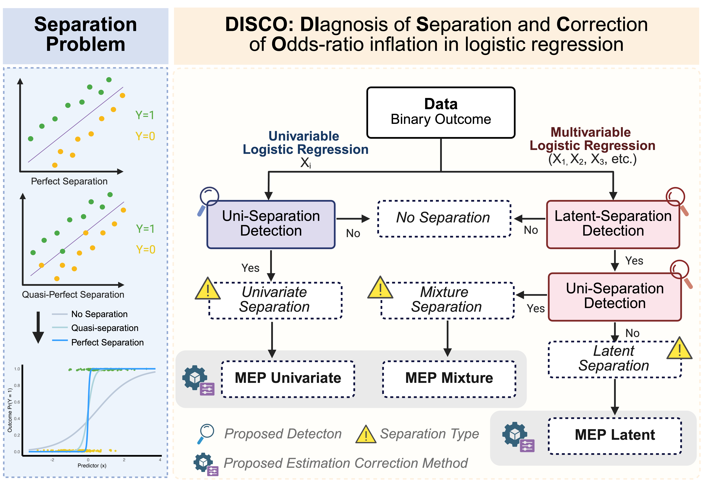
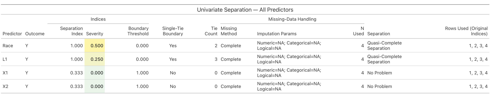
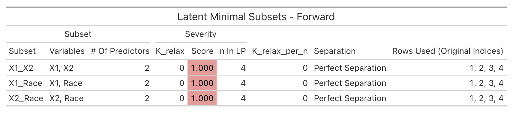
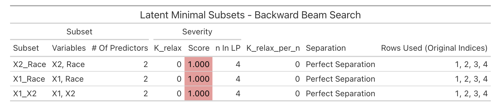

# DISCO
**DI**agnosis of **S**eparation and **C**orrection of **O**dds-ratio inflation in logistic regression

>DIagnosis of Separation in Logistic Regression: detect perfect and quasi-complete separation in binary outcomes with a clear severity score and traceable summaries.

>Correction of Odds-Ratio Inflation: stabilize estimates under separation using Bayesian framework.
---

## Why separation matters
>When predictors perfectly or quasi-completely separate a binary outcome, logistic regression can yield infinite or severely inflated odds ratios and unstable inference.
---

## Overview




### Separation Diagnosis
- `uni_separation()` — univariate detector using:
  - Hungarian matching to align clusters,
  - a **vectorized Rand index**,
  - a **non-negative boundary threshold** to guard against boundary ties,
  - a **continuous severity score** in [0,1].
- `latent_separation()` multivariate detector using LP-based linear programming with options to:
  - detect **perfect**, **quasi-complete**, or **either** type of separation
  - search for separating predictor subsets
  - use fixed-sample subset evaluation with `missing_scope = "global"`
  - choose subset search strategy: forward enumeration or backward beam search
  - control backward beam search with `beam_width`
  - optionally print progress and stop reasons during minimal subset search with `verbose = TRUE`

### Estimation Correction
- `MEP_Univariate()` — DISCO-severity-adaptive **univariate** logistic regression with an **MEP** prior; standardized X for **severity & fit**, optional back-transforms (logit / SAS / Long), and a GLM comparator on standardized X.
- `MEP_latent()` — **unified latent** (numeric **+ factor** support via `model.matrix`): handles missingness **once** on raw `y, X`, encodes factors (treatment; baseline = first level), **safe-scales encoded columns**, runs a small grid over $(\mu, \sigma_{\text{global}}, \kappa)$, and selects one run via acceptance-window + GLM-ratio closeness + posterior predictive agreement. Reports working-scale summaries **with CIs** and back-transformed **b_A / b_SAS / b_Long** **(per encoded column)** with CIs.
- `MEP_mixture()` — **severity-anchored multi-predictor** logistic with **numeric + factor** predictors. Encodes factors via `model.matrix(~ ., data = X)`, anchors slope prior scales by **per-predictor DISCO severities** (numeric severities computed on z-scores; factors unchanged for severity step), runs a small grid (intercept mean offsets, global slope multipliers, κ), and selects one run via acceptance window + checks. Reports posterior **means** on the standardized scale and optional back-transformed **A / SAS / Long** **means** per encoded column.

---

## Installation

```r
# install.packages("devtools")
devtools::install_github("bioscinema/DISCO")
library(DISCO)
```

> Recommendation: Provide complete-case data to all functions. Missingness is assumed to have been handled upstream.

---

## Separation Diagnosis

```r
set.seed(2025)
df_toy <- data.frame(
  Y    = c(0,0,1,0),
  X1   = c(6.1,0.5, 5.0, 1.5),
  X2   = c(4,10, 6,2),
  Race = factor(c("C","A","C","B")),
  L1   = c(TRUE,TRUE, TRUE, FALSE)
)
```

### Univariate Separation

```r
# install.packages("gt")
library(gt)

# One predictor
res_uni_cc <- uni_separation(df_toy, "X1", "Y")
gt_uni_separation(res_uni_cc, title = "Univariate (X1 vs Y) — Complete-case")

# All predictors vs outcome (one-shot summary)
gt_uni_separation_all(df_toy, outcome = "Y")
```



> This table summarizes univariate screen results of each predictor against the outcome (`Y`). It flags whether any single predictor causes separation in a logistic model.

**Column guide**

- **Predictor**: Predictor being screened (one at a time).
- **Outcome**: Binary outcome used for screening.
- **Separation Index**: Rand index between the observed outcome labels and the best aligned 2-group split induced by the predictor. Values closer to 1 indicate stronger separability.
- **Severity**: Continuous score in \[0,1\] summarizing the strength of the separation signal after accounting for boundary ties. Higher means more severe.
- **Boundary Threshold**: Non-negative tie-adjusted threshold used to guard against boundary artifacts. Quasi separation is only called when `Separation Index > Boundary Threshold`.
- **Single-Tie Boundary**: Whether there is exactly one shared predictor value between classes that lies on the separating boundary.
- **Tie Count**: Number of rows that take the boundary tie value (only relevant when `Single-Tie Boundary = Yes`).
- **Separation**: Final label for the predictor (for example `Perfect Separation`, `Quasi-Complete Separation`, or `No Problem`).
- **Rows Used (Original Indices)**: Original row indices retained for this test, so results are fully traceable to the input data.


### Latent Separation

`latent_separation()` is a multivariate detector using LP-based feasibility feasibility and severity diagnostics. It first checks for complete separation using a max-margin LP, then computes a multivariate severity lower bound, `K_relax`, for quasi-complete separation.

By default, weak quasi-complete separation is treated as no separation when `K_relax / n` is large, controlled by `quasi_to_none_if = 0.5`.

#### Minimal subset search strategies

- `minimal_strategy = "forward"`: enumerates subsets in increasing size and returns minimal separating subsets. This is exact but can be expensive.
- `minimal_strategy = "backward"`: starts from the full predictor set and removes predictors layer by layer.
  - By default, backward search uses a beam-style search.
  - `beam_width` controls how many best separating subsets are retained at each layer.
  - Ties at the beam cutoff are retained.
- `minimal_strategy = "auto"`: uses forward search when `p <= small_p_threshold`, and backward search otherwise.
- `backward_exhaustive = TRUE`: uses layered exhaustive backward search instead of beam search, keeping all separating subsets at each layer subject to `eval_limit`. This can be expensive for moderate or large `p`.

#### Progress reporting

- Set `verbose = TRUE` to print progress updates and key stop reasons for minimal subset search.
- For advanced control, you can also set `options(latent_separation.show_progress = TRUE)`. When `verbose = TRUE`, progress is enabled automatically.

#### Forward Diagnosis (recommend for small p)
```r
res_lat_com <- latent_separation(
  y = df_toy$Y,
  X = df_toy[, c("X1","X2","Race","L1")],
  find_minimal = TRUE,
  minimal_strategy = "forward",
  verbose = TRUE
)
gt_latent_separation(res_lat_com, title = "Latent Minimal Subsets - Forward")

```


> This table summarizes multivariate (latent) separation results from `latent_separation (find_minimal = TRUE)`. Each row is a separating subset found by the chosen search strategy (here, forward).

**Column guide**

- **Subset**: Internal name for the subset (typically predictor names joined by underscores).
- **Variables**: Predictor names included in the subset.
- **# Of Predictors**: Subset size \(k\).
- **K_relax**: Severity lower bound from the LP relaxation. Smaller values indicate more severe separation. `0` corresponds to perfect separation.
- **Score**: Severity score in \[0,1\], computed as `1 - (K_relax / n)`. Larger values indicate more severe separation.
- **n In LP**: Number of rows used in the LP for this subset.
- **Separation**: Final label for the subset (for example `Perfect Separation`).
- **Rows Used (Original Indices)**: Original row indices retained for this subset test, so results are fully traceable.

#### Backward Diagnosis (recommended for large p)

Backward search is recommended for larger `p`. By default, it uses a beam-style search: starting from the full predictor set, it removes one predictor at a time and retains the best separating subsets at each layer. The number of retained subsets is controlled by `beam_width`.

```r
res_lat_com <- latent_separation(
  y = df_toy$Y,
  X = df_toy[, c("X1","X2","Race","L1")],
  find_minimal = TRUE,
  minimal_strategy = "backward",
  beam_width = 10,
  verbose = TRUE
)
gt_latent_separation(res_lat_com, title = "Latent Minimal Subsets - Backward Beam Search")
```


If `backward_exhaustive = TRUE`, the algorithm performs layered exhaustive backward search. It starts from the full predictor set, generates all one-variable-deleted candidates from the current separating frontier, and keeps all separating subsets at each layer. It stops when no smaller separating subset is found, when `min_vars` is reached, or when `eval_limit` is exceeded.

```r
res_lat_com <- latent_separation(
  y = df_toy$Y,
  X = df_toy[, c("X1","X2","Race","L1")],
  find_minimal = TRUE,
  minimal_strategy = "backward",
  backward_exhaustive = TRUE,
  missing_scope = "global",
  verbose = TRUE
)
```

#### Runtime controls

For large subset searches, you can limit evaluations and control progress frequency:

```r
options(latent_separation.eval_limit = 5000)
options(latent_separation.progress_every = 200)
```

---

## Univariate Issue — `MEP_Univariate`

`MEP_Univariate()` fits **intercept + one predictor** logistic regression with a **severity-adaptive MEP prior** informed by `uni_separation()`. It uses a random-walk MH sampler with light auto-tuning.

Numeric predictors are z-scored for severity, GLM comparator, and the Bayesian fit; 2-level factors are converted to 0/1 for estimation/comparator (error if >2 levels).

**Defaults (match SLURM script):**
-`burn_in = 5000`, `n_iter = 15000` 
- Proposal s.d. blend: `step = 0.30*(1-severity) + 0.12*severity`
- Prior scales: `sigma0 = 10`, `sigma1_hi = 5`, `sigma1_lo = 0.15`
- Shape blend: `kappa = 1 + severity*(2.5 - 1)`
- `ci_level = 0.95`, MH auto-tuning during burn-in (`tune_threshold_hi = 0.45`, `tune_threshold_lo = 0.20`, `tune_interval = 500`)
- `compare = TRUE` fits a GLM comparator on standardized X

**Output**
- `posterior`: summaries for **standardized** `beta1` only. If `transform_beta1 ∈ {logit, SAS, Long}`, also includes the corresponding slope on the original predictor scale (`beta1_logit` or `beta1_SAS` or `beta1_Long`).
- `disco`: severity metadata (`separation_type`, `severity_score`, `boundary_threshold`, `single_tie_boundary`, `missing_info` including `rows_used`).
- `prior`, `mcmc` (including burn-in step-size trace), `comparators$glm` (coefficients on standardized X), `rows_used`.
- If `return_draws = TRUE`, returns `draws$chain_std` and `draws$chain_orig`.

**Reproducibility**
For reproducible chains, pass explicit `chain_seeds`. If `chain_seeds` is `NULL`, random seeds are generated.

**Examples**

```r
y <- c(0,0,0,0, 1,1,1,1)
x <- c(-0.52, -0.07, -0.60, -0.67, 1.39, 0.16, 1.40, 0.09)
df <- data.frame(y = y, x = x)

detect <- DISCO::uni_separation(df, predictor = "x", outcome = "y")
detect$separation_type # e.g., "Perfect separation"

## 1) Default: STANDARDIZED coefficients for predictor
fit_std <- MEP_Univariate(
  data = df, predictor = "x", outcome = "y"
)
fit_std$posterior
fit_logit$diagnostics_single

## 2) Back-transform slope to ORIGINAL-x units on the LOGIT scale
fit_logit <- MEP_Univariate(
  data = df, predictor = "x", outcome = "y",
  transform_beta = "logit"
)
fit_logit$posterior
fit_logit$diagnostics_single

## 3) Multiple chains
fit_multi <- MEP_Univariate(
  data = df, predictor = "x", outcome = "y",
  n_chains = 4,
  chain_seeds = c(101, 102, 103, 104),
  combine_chains = "stack"
)
fit_multi$posterior
fit_multi$diagnostics_multi
```

---

## Unified Latent Issue — `MEP_latent`

`MEP_latent()` fits **intercept + one predictor + covariates** logistic regression. 


**What it does**
- **Encodes factors** in `X` with `model.matrix(~ ., data = X)` (treatment contrasts, baseline = first level), drops the intercept, and fits on the **numeric encoded** design.
- Standardizes encoded predictors with a **safe scaler** (sd set to 1 when sd=0 or non-finite).
- For each grid setting, runs RW-MH and computes acceptance rate, posterior summaries, and a posterior predictive match statistic.
- **Selects one grid point using** by: (i) acceptance-rate window, (ii) closeness to a GLM coefficient-ratio reference (same standardized working scale), and (iii) posterior predictive agreement.
- Reruns the selected grid point using chains and returns final summaries.

**Factor handling & encoded names**
- **Numeric predictors** appear as a single encoded column with their original name (e.g., `X3`).
- **Factors** expand to treatment-contrast dummies (baseline = first level). For a 2-level factor `G` with levels `A` (baseline) and `B`, the encoded column is `GB` (effect **B vs A**). Change the baseline beforehand with `stats::relevel()`.
- All reported effects are **per encoded column**.

**Back-transforms**
- Let \(s_x\) be the SD of an encoded column (numeric or 0/1 dummy) on the encoded `X` scale, and \(\beta_\text{std}\) the slope in the standardized design. We report:
  - `b_A_original  = β_std / s_x` (per-unit effect on encoded scale),
  - `b_SAS_original  = b_A_original * π/√3`,
  - `b_Long_original = b_A_original * (π/√3 + 1)`.
  For a 0/1 dummy with prevalence \(p\), \(s_x = \sqrt{p(1-p)}\).

**Returns**

- `best_settings`: list with the selected prior setting  
  - `mu`: prior mean vector (stored as a comma-separated string)  
  - `Sigma_diag`: diagonal of the prior scale matrix (stored as a comma-separated string)  
  - `kappa`: selected EP shape parameter  
  - `kappa_mode`: `"auto"` or `"fixed"`
  - `acceptance_rate`: mean MH acceptance rate across best-point rerun chains  
  - `prop_matched`: mean posterior predictive match statistic across best-point rerun chains  

- `posterior_means`: posterior means for all parameters on the working scale  
  - order matches `scaled_summary$Param` (Intercept, then encoded columns)

- `scaled_summary`: working-scale posterior summary table (includes Intercept)  
  - columns: `Param`, `Mean`, `SD`, `CI_low`, `CI_high`, `Sig`, `Star`

- `standardized_coefs_back`: per encoded predictor-column effects with uncertainty  
  - `Predictor`: encoded column name (from `model.matrix`)  
  - `Scaled`, `Scaled_CI_low`, `Scaled_CI_high`: slope on standardized-design scale  
  - `b_A_original`, `b_A_CI_low`, `b_A_CI_high`: per-unit effect on encoded scale  
  - `b_SAS_original`, `b_SAS_CI_low`, `b_SAS_CI_high`: SAS rescaling  
  - `b_Long_original`, `b_Long_CI_low`, `b_Long_CI_high`: Long rescaling

- `burnin_step_trace_best`: list of length `n_chains`  
  - each element is a data.frame with columns `iter`, `acceptance`, `step_size` recording burn-in tuning checkpoints

- `step_size_final_best`: numeric vector of length `n_chains` with the final tuned step sizes

- Diagnostics (only when `coda` is available)  
  - if `n_chains == 1`: `diagnostics_single` with `ess`, `geweke_z`, `ess_min`, `geweke_max_abs`, `converged`  
  - if `n_chains >= 2`: `diagnostics_multiple` with `rhat`, `rhat_max`, `ess`, `ess_min`

- `draws` (optional, when `return_draws = TRUE`)  
  - if `n_chains == 1`: a matrix of post-burn draws (rows = iterations, cols = parameters)  
  - if `n_chains >= 2`: a list of length `n_chains`, each a post-burn draw matrix


**Examples**

```r
y <- c(0,0,0,0, 1,1,1,1)
X <- data.frame(
  X1 = c(-1.86, -0.81,  1.32, -0.40,  0.91,  2.49,  0.34,  0.25),
  X2 = c( 0.52,  -0.07,  0.60,  0.67, -1.39,  0.16, -1.40, -0.09)
)

## Single Chain
fit_single <- MEP_latent(
  y, X,
  n_chains = 1,
  chain_seed = 9
)
fit_single$scaled_summary
fit_single$diagnostics_single


## Multiple Chains
fit_multi <- MEP_latent(
  y, X,
  n_chains = 4,
  chain_seeds = c(101, 102, 103, 104),
  combine_chains = "stack",
  return_draws = TRUE
)
fit_multi$scaled_summary
fit_multi$diagnostics_multi

```

---

## Mixture Issue — `MEP_mixture()` 

`MEP_mixture()` fits a multi-predictor logistic regression with an MEP prior where slope prior scales are anchored by per-predictor DISCO severities.


**What it does**
- Checks `y` and `X` are complete-case and compatible.
- Encodes factors using `model.matrix(~ ., data = X)` (treatment coding; baseline is the first level) and drops the intercept.
- Computes univariate DISCO severity for each original predictor (numeric predictors are z-scored for the severity step).
- Maps severity to anchor slope prior scales and an anchor-average `kappa`.
- Runs a small grid over intercept prior mean offsets, global slope multipliers, and `kappa`, then selects one grid point using an acceptance-rate window, posterior predictive agreement, and (when available) GLM ratio closeness relative to a reference predictor.
- Reruns the selected grid point using `n_chains` chains and returns final summaries.

**Factor handling and encoded names**
- Numeric predictors remain one encoded column with their original name.
- Factors expand to treatment-contrast dummies (baseline is the first level). For a two-level factor `X3` with levels `A` (baseline) and `B`, the encoded column is `X3B` (effect `B` vs `A`).

**Returns**
- `ref_predictor`, `severity`, `grid_summary`
- `best_settings`: selected grid setting, including `acceptance_rate` and `prop_matched`
- `posterior_means`
- `scaled_summary`
- `standardized_coefs_back`
- `burnin_step_trace_best`, `step_size_final_best`
- Diagnostics (only when `coda` is available):
  - `diagnostics_single` if `n_chains == 1`
  - `diagnostics_multiple` if `n_chains >= 2`
- `draws` if `return_draws = TRUE` (matrix for one chain; list of matrices for multiple chains)

**Examples**
```r
y <- c(0,0,0,0, 1,1,1,1)
X <- data.frame(
  X1 = c(-1.86,-0.81, 1.32,-0.40, 0.91, 2.49, 0.34, 0.25),
  X2 = c( 0.52,-0.07, 0.60, 0.67,-1.39, 0.16,-1.40,-0.09),
  X3 = factor(c(rep("A",4), rep("B",4)))
)

## Single Chain
fit_single <- MEP_mixture(
  y, X,
  n_chains = 1,
  chain_seed = 9
)
fit_single$scaled_summary
fit_single$diagnostics_single

## Multiple Chains
fit_multi <- MEP_mixture(
  y, X,
  n_chains = 4,
  chain_seed = c(101, 102, 103, 104),
  combine_chains = "stack"
)
fit_multi$scaled_summary
fit_multi$diagnostics_multiple
```

**Notes**
- Standardization/back-transforms use **unscaled encoded** column SDs; for a 0/1 dummy with prevalence \\(p\\), SD is \\(\\sqrt{p(1-p)}\\).
- The **reference predictor** for ratios comes from original `X` (default = highest severity). If a factor, the denominator is its **first dummy**.
- Naming note: `MEP_latent()` reports `b_A_*` for the per-unit (logit) effect; `MEP_mixture()` uses `b_logit_*`. These are equivalent (A ≡ logit).

---

### Notes & assumptions
- Outcome is binary and will be normalized to `{0,1}` (supports logical or 2-level factor/character).
- Categorical predictors are handled directly (univariate) or via dummy encoding (latent / mixture).
- **MEP_latent** and **MEP_mixture** outputs are per **encoded** column (e.g., `FactorLevel` dummies) **with CIs**.
- Change baselines with `stats::relevel()` to alter dummy interpretation.
- Testing:
  ```r
  devtools::test()
  # or
  testthat::test_dir("tests/testthat")
  ```
