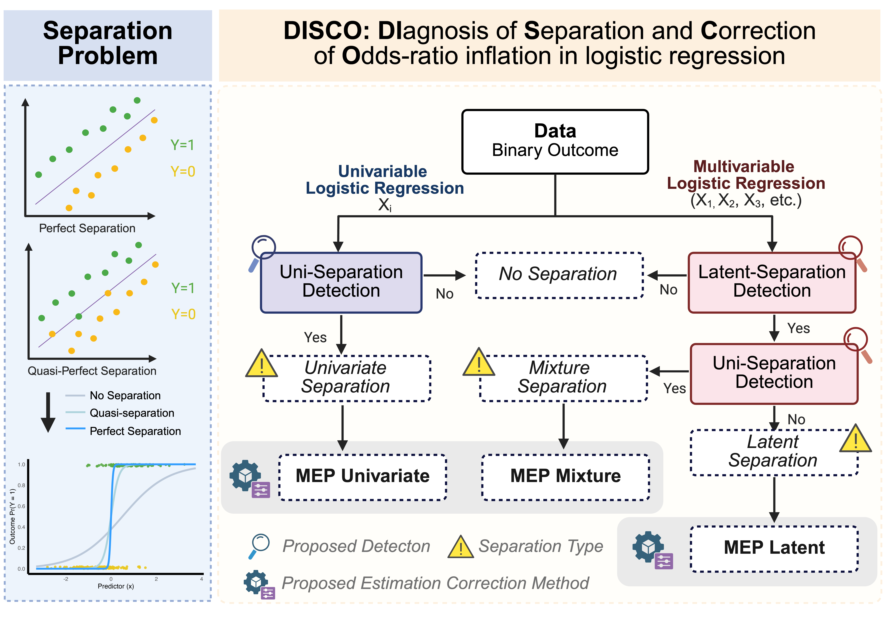
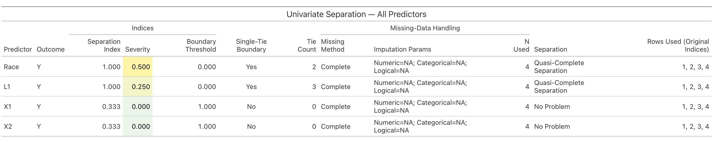
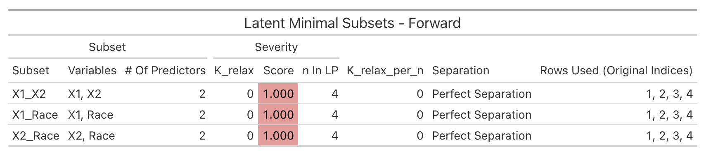
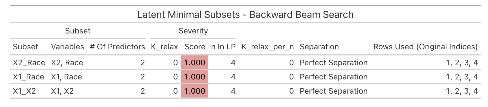

# DISCO
**DI**agnosis of **S**eparation and **C**orrection of **O**dds-ratio inflation in logistic regression

>DIagnosis of Separation in Logistic Regression: detect perfect and quasi-complete separation in binary outcomes with a clear severity score and traceable summaries.

>Correction of Odds-Ratio Inflation: stabilize estimates under separation using Multi-adaptive Exponential Power Procedure (MEP).
---

## Why separation matters
>When predictors perfectly or quasi-completely separate a binary outcome, logistic regression can yield infinite or severely inflated odds ratios and unstable inference.
---

## Overview




### Separation Diagnosis
- `uni_separation()` — univariate detector using:
  - Hungarian matching to align clusters,
  - a **vectorized Rand index**,
  - a **non-negative boundary threshold** to guard against boundary ties,
  - a **continuous severity score** in [0,1].
- `latent_separation()` multivariate detector using LP-based linear programming with options to:
  - detect **perfect**, **quasi-complete**, or **either** type of separation
  - search for separating predictor subsets
  - use fixed-sample subset evaluation with `missing_scope = "global"`
  - choose subset search strategy: forward enumeration or backward beam search
  - control backward beam search with `beam_width`
  - optionally print progress and stop reasons during minimal subset search with `verbose = TRUE`

### Estimation Correction
- `MEP_Univariate()` — direct diagnosis-guided **univariate** MEP. The function runs `uni_separation()` internally, maps the resulting severity score directly to the slope diagonal scatter entry and the EP shape parameter, and fits the model without a hyperparameter grid search.
- `MEP_latent()` — global-grid MEP for **pure latent separation**. Pure latent separation is assumed to have been diagnosed before calling the function. Encoded slopes share a common diagonal scatter entry selected from `sigma2_slope_grid`, while the function searches over prior location, the common slope scatter entry, and `kappa`.
- `MEP_mixture()` — local-plus-global MEP for **mixture separation**. The function computes predictor-specific univariate severities, maps them to local slope scatter and shape anchors, then searches over a global scatter multiplier and a global `kappa` grid around the average shape anchor. Mixture/latent classification is assumed to have been established before calling the function.

**MEP parameterization.** In the estimation functions, arguments beginning with `sigma2_` refer to diagonal scatter quantities used to construct the MEP scatter matrix \(\Sigma\). These quantities are placed directly into \(\Sigma\); they should not generally be interpreted as marginal prior variances when \(\kappa \neq 1\). `posterior_point = "mean"` is the default in all three functions. Both posterior means and medians are always returned, and `posterior_point = "median"` changes the final reported point estimate without changing the latent/mixture grid-selection rule.

---

## Installation

```r
# install.packages("devtools")
devtools::install_github("bioscinema/DISCO")
library(DISCO)
```

> Recommendation: Provide complete-case data to all functions. Missingness is assumed to have been handled upstream.

---

## Separation Diagnosis

```r
set.seed(2025)
df_toy <- data.frame(
  Y    = c(0,0,1,0),
  X1   = c(6.1,0.5, 5.0, 1.5),
  X2   = c(4,10, 6,2),
  Race = factor(c("C","A","C","B")),
  L1   = c(TRUE,TRUE, TRUE, FALSE)
)
```

### Univariate Separation

```r
# install.packages("gt")
library(gt)

# One predictor
res_uni_cc <- uni_separation(df_toy, "X1", "Y")
gt_uni_separation(res_uni_cc, title = "Univariate (X1 vs Y) — Complete-case")

# All predictors vs outcome (one-shot summary)
gt_uni_separation_all(df_toy, outcome = "Y")
```



> This table summarizes univariate screen results of each predictor against the outcome (`Y`). It flags whether any single predictor causes separation in a logistic model.

**Column guide**

- **Predictor**: Predictor being screened (one at a time).
- **Outcome**: Binary outcome used for screening.
- **Separation Index**: Rand index between the observed outcome labels and the best aligned 2-group split induced by the predictor. Values closer to 1 indicate stronger separability.
- **Severity**: Continuous score in \[0,1\] summarizing the strength of the separation signal after accounting for boundary ties. Higher means more severe.
- **Boundary Threshold**: Non-negative tie-adjusted threshold used to guard against boundary artifacts. Quasi separation is only called when `Separation Index > Boundary Threshold`.
- **Single-Tie Boundary**: Whether there is exactly one shared predictor value between classes that lies on the separating boundary.
- **Tie Count**: Number of rows that take the boundary tie value (only relevant when `Single-Tie Boundary = Yes`).
- **Separation**: Final label for the predictor (for example `Perfect Separation`, `Quasi-Complete Separation`, or `No Problem`).
- **Rows Used (Original Indices)**: Original row indices retained for this test, so results are fully traceable to the input data.


### Latent Separation

`latent_separation()` is a multivariate detector using LP-based feasibility feasibility and severity diagnostics. It first checks for complete separation using a max-margin LP, then computes a multivariate severity lower bound, `K_relax`, for quasi-complete separation.

By default, weak quasi-complete separation is treated as no separation when `K_relax / n` is large, controlled by `quasi_to_none_if = 0.5`.

#### Minimal subset search strategies

- `minimal_strategy = "forward"`: enumerates subsets in increasing size and returns minimal separating subsets. This is exact but can be expensive.
- `minimal_strategy = "backward"`: starts from the full predictor set and removes predictors layer by layer.
  - By default, backward search uses a beam-style search.
  - `beam_width` controls how many best separating subsets are retained at each layer.
  - Ties at the beam cutoff are retained.
- `minimal_strategy = "auto"`: uses forward search when `p <= small_p_threshold`, and backward search otherwise.
- `backward_exhaustive = TRUE`: uses layered exhaustive backward search instead of beam search, keeping all separating subsets at each layer subject to `eval_limit`. This can be expensive for moderate or large `p`.

#### Progress reporting

- Set `verbose = TRUE` to print progress updates and key stop reasons for minimal subset search.
- For advanced control, you can also set `options(latent_separation.show_progress = TRUE)`. When `verbose = TRUE`, progress is enabled automatically.

#### Forward Diagnosis (recommend for small p)
```r
res_lat_com <- latent_separation(
  y = df_toy$Y,
  X = df_toy[, c("X1","X2","Race","L1")],
  find_minimal = TRUE,
  minimal_strategy = "forward",
  verbose = TRUE
)
gt_latent_separation(res_lat_com, title = "Latent Minimal Subsets - Forward")

```


> This table summarizes multivariate (latent) separation results from `latent_separation (find_minimal = TRUE)`. Each row is a separating subset found by the chosen search strategy (here, forward).

**Column guide**

- **Subset**: Internal name for the subset (typically predictor names joined by underscores).
- **Variables**: Predictor names included in the subset.
- **# Of Predictors**: Subset size \(k\).
- **K_relax**: Severity lower bound from the LP relaxation. Smaller values indicate more severe separation. `0` corresponds to perfect separation.
- **Score**: Severity score in \[0,1\], computed as `1 - (K_relax / n)`. Larger values indicate more severe separation.
- **n In LP**: Number of rows used in the LP for this subset.
- **Separation**: Final label for the subset (for example `Perfect Separation`).
- **Rows Used (Original Indices)**: Original row indices retained for this subset test, so results are fully traceable.

#### Backward Diagnosis (recommended for large p)

Backward search is recommended for larger `p`. By default, it uses a beam-style search: starting from the full predictor set, it removes one predictor at a time and retains the best separating subsets at each layer. The number of retained subsets is controlled by `beam_width`.

```r
res_lat_com <- latent_separation(
  y = df_toy$Y,
  X = df_toy[, c("X1","X2","Race","L1")],
  find_minimal = TRUE,
  minimal_strategy = "backward",
  beam_width = 10,
  verbose = TRUE
)
gt_latent_separation(res_lat_com, title = "Latent Minimal Subsets - Backward Beam Search")
```


If `backward_exhaustive = TRUE`, the algorithm performs layered exhaustive backward search. It starts from the full predictor set, generates all one-variable-deleted candidates from the current separating frontier, and keeps all separating subsets at each layer. It stops when no smaller separating subset is found, when `min_vars` is reached, or when `eval_limit` is exceeded.

```r
res_lat_com <- latent_separation(
  y = df_toy$Y,
  X = df_toy[, c("X1","X2","Race","L1")],
  find_minimal = TRUE,
  minimal_strategy = "backward",
  backward_exhaustive = TRUE,
  missing_scope = "global",
  verbose = TRUE
)
```

#### Runtime controls

For large subset searches, you can limit evaluations and control progress frequency:

```r
options(latent_separation.eval_limit = 5000)
options(latent_separation.progress_every = 200)
```

---

## Univariate Issue — `MEP_Univariate`

`MEP_Univariate()` fits an **intercept + one predictor** logistic regression using the direct diagnosis-guided MEP strategy for univariate separation. It runs `uni_separation()` internally, maps the resulting severity score directly to the slope diagonal scatter entry and the EP shape parameter, and then fits the model by RW-MH. **No hyperparameter grid search is performed in this branch.**

Numeric predictors are z-scored for severity, the GLM comparator, and the Bayesian fit; 2-level factors are converted to 0/1 for estimation/comparison (error if >2 levels).

The scatter matrix is

\[
\Sigma = \operatorname{diag}(\sigma_0^2,\sigma_1^2),
\]

where the user-facing `sigma2_*` arguments are the diagonal scatter entries placed directly into \(\Sigma\).

**Current defaults**
- `burn_in = 5000`, `n_iter = 15000`
- Proposal s.d. blend: `step = 0.30*(1-severity) + 0.12*severity`
- `sigma2_intercept = 100`
- `sigma2_hi = 25`, `sigma2_lo = 0.0225`
- Severity-adaptive slope scatter:
  \[
  \log(\sigma_1^2)=(1-s)\log(25)+s\log(0.0225)
  \]
- Shape blend: `kappa = 1 + severity*(2.5 - 1)`
- `posterior_point = "mean"`; `"median"` may be used for the final point estimate
- `ci_level = 0.95`
- MH auto-tuning during burn-in: `tune_threshold_hi = 0.45`, `tune_threshold_lo = 0.20`, `tune_interval = 500`
- `compare = TRUE` fits a GLM comparator on standardized X
- `return_draws = TRUE`

The current `sigma2_*` defaults are numerically equivalent to the earlier SD-style defaults `sigma0 = 10`, `sigma1_hi = 5`, and `sigma1_lo = 0.15`. The old names remain available as deprecated backward-compatible aliases and are squared internally.

**Output**
- `posterior_point`: selected point-summary rule (`"mean"` or `"median"`).
- `posterior_means`, `posterior_medians`, `posterior_estimates`: posterior point summaries for intercept and slope on the working scale.
- `posterior`: summary for standardized `beta1`; columns include `Estimate`, `Mean`, `Median`, `SD`, `CI_low`, `CI_high`, `Sig_0`, and `Star`. If `transform_beta` is one of `"logit"`, `"SAS"`, or `"Long"`, the corresponding slope on the original predictor scale is also returned.
- `disco`: severity metadata (`separation_type`, `severity_score`, `boundary_threshold`, `single_tie_boundary`, and missing-data information).
- `prior`, `mcmc`, `comparators$glm`, and `rows_used`.
- If `return_draws = TRUE`, `draws$chain_std` and `draws$chain_orig` are returned.

**Reproducibility**
For reproducible chains, pass explicit `chain_seeds`. If `chain_seeds` is `NULL`, random seeds are generated.

**Examples**

```r
y <- c(0,0,0,0, 1,1,1,1)
x <- c(-0.52, -0.07, -0.60, -0.67, 1.39, 0.16, 1.40, 0.09)
df <- data.frame(y = y, x = x)

detect <- DISCO::uni_separation(df, predictor = "x", outcome = "y")
detect$separation_type

## 1) Default: posterior mean on the standardized coefficient scale
fit_std <- MEP_Univariate(data = df, predictor = "x", outcome = "y")
fit_std$posterior

## 2) Use posterior median as the reported point estimate
fit_med <- MEP_Univariate(
  data = df, predictor = "x", outcome = "y",
  posterior_point = "median"
)
fit_med$posterior

## 3) Back-transform slope to original-x units on the logit scale
fit_logit <- MEP_Univariate(
  data = df, predictor = "x", outcome = "y",
  transform_beta = "logit"
)
fit_logit$posterior

## 4) Multiple chains
fit_multi <- MEP_Univariate(
  data = df, predictor = "x", outcome = "y",
  n_chains = 4,
  chain_seeds = c(101, 102, 103, 104),
  combine_chains = "stack"
)
fit_multi$diagnostics_multi
```

---

## Pure Latent Issue — `MEP_latent()`

`MEP_latent()` is the global-grid MEP implementation for **pure latent separation**. Pure latent separation is assumed to have been diagnosed before calling this function; the function does not compute or numerically use `K_relax` or another latent severity score. Because this branch does not use predictor-specific univariate severity for localized shrinkage, all encoded slopes share a common diagonal scatter entry selected from a global grid.

The function searches over prior location, a common slope scatter entry, and `kappa`, then selects one grid point using the acceptance-rate criterion, GLM coefficient-ratio closeness when available, and posterior predictive agreement.

**Current parameterization and defaults**
- `mu_vals = seq(-1, 1, by = 0.1)`; for each candidate `m`, the current implementation uses `mu = rep(m, p_all)`.
- `sigma2_intercept = 10`.
- `sigma2_slope_grid = c(0.1, 0.5, 1, 2, 5, 10)`; each candidate is placed directly into every slope diagonal entry of \(\Sigma\).
- `kappa_mode = "auto"` by default with `kappa_vals = c(0.5, 1, 2)`; alternatively `kappa_mode = "fixed"` uses `kappa_fixed` (default `1`).
- `burn_in = 1000`, `n_iter = 9000`, `step_size = 0.40`.
- Grid acceptance window `c(0.30, 0.40)` with fallback target `0.35`.
- `ppc_threshold = 0.80`.
- `posterior_point = "mean"`; `"median"` may be used for the final user-facing point estimate.
- Grid selection remains based on posterior means for backward compatibility; changing `posterior_point` does not change the selected grid point.

The previous names `sigma0_intercept` and `sigma_global_multipliers` remain available as deprecated aliases. In the latent branch, the former `sigma_global_multipliers` values were already used directly as candidate slope diagonal scatter entries, so `sigma2_slope_grid` is the more accurate name.

**Factor handling and encoded names**
- Factors are encoded using `model.matrix(~ ., data = X)` with treatment contrasts and the first level as baseline.
- Numeric predictors remain one encoded column with their original name.
- Encoded predictor columns are internally standardized with a safe scaler.
- All reported slope effects are per encoded column.

**Back-transforms**
Let \(s_x\) be the SD of an encoded column and \(\beta_{std}\) the slope in the standardized design. The function reports:
- `b_A_original = beta_std / s_x`
- `b_SAS_original = b_A_original * pi/sqrt(3)`
- `b_Long_original = b_A_original * (pi/sqrt(3) + 1)`

For a 0/1 dummy with prevalence \(p\), \(s_x=\sqrt{p(1-p)}\).

**Returns**
- `best_settings`: selected prior location, `Sigma_diag`, `kappa`, `kappa_mode`, acceptance rate, and posterior predictive match statistic.
- `posterior_point`, `posterior_means`, `posterior_medians`, `posterior_estimates`.
- `scaled_summary`: `Param`, `Estimate`, `Mean`, `Median`, `SD`, `CI_low`, `CI_high`, `Sig`, `Star`.
- `standardized_coefs_back`: selected estimate, mean, median, and credible interval for the standardized slope and each back-transformed scale.
- `burnin_step_trace_best`, `step_size_final_best`.
- `diagnostics_single` or `diagnostics_multiple` when `coda` is available.
- `draws` when `return_draws = TRUE`.

**Examples**

```r
y <- c(0,0,0,0, 1,1,1,1)
X <- data.frame(
  X1 = c(-1.86, -0.81,  1.32, -0.40,  0.91,  2.49,  0.34,  0.25),
  X2 = c( 0.52, -0.07,  0.60,  0.67, -1.39,  0.16, -1.40, -0.09)
)

## Single chain
fit_single <- MEP_latent(
  y, X,
  n_chains = 1,
  chain_seeds = 9
)
fit_single$scaled_summary
fit_single$diagnostics_single

## Posterior median as the reported point estimate
fit_median <- MEP_latent(
  y, X,
  posterior_point = "median",
  chain_seeds = 9
)
fit_median$scaled_summary

## Multiple chains
fit_multi <- MEP_latent(
  y, X,
  n_chains = 4,
  chain_seeds = c(101, 102, 103, 104),
  combine_chains = "stack",
  return_draws = TRUE
)
fit_multi$scaled_summary
fit_multi$diagnostics_multiple
```

---

## Mixture Issue — `MEP_mixture()`

`MEP_mixture()` is the local-plus-global MEP implementation for **mixture separation**. Mixture/latent classification is assumed to have been established before calling the function. The function computes predictor-specific univariate DISCO severities internally and uses them to construct local slope scatter anchors and local shape anchors. A global multiplier grid then rescales the local slope scatter anchors, while the global shape grid is formed from offsets around the average severity-derived shape anchor.

Latent severity does **not** directly enter the numerical hyperparameter mapping in this function.

**Current parameterization and defaults**
- Intercept prior mean grid: `logit(mean(y)) + mu_intercept_offsets`, where `mu_intercept_offsets = seq(-1, 1, by = 0.2)`; slope prior means are zero.
- `sigma2_intercept = 10`.
- Local scatter anchors: `sigma2_hi = 5`, `sigma2_lo = 0.15`.
- For predictor severity \(s_j\):
  \[
  \log(\sigma_{j,anchor}^2)=(1-s_j)\log(5)+s_j\log(0.15).
  \]
- `sigma2_global_multipliers = c(0.1, 0.5, 1, 2, 5, 10)`; these are **dimensionless multipliers**, not direct slope diagonal entries. The actual slope scatter entry is `sigma2_anchor * global_multiplier`.
- Shape anchors: `kappa_min = 1`, `kappa_max = 2.5`.
- `kappa_delta = seq(-0.5, 0.5, by = 0.2)`, giving offsets `{-0.5, -0.3, -0.1, 0.1, 0.3, 0.5}` around the mean shape anchor, truncated to `[0.5, 3]`.
- `burn_in = 1000`, `n_iter = 9000`, `step_size = 0.40`.
- Grid acceptance window `c(0.30, 0.40)` with fallback target `0.35`.
- `ppc_threshold = 0.80`.
- `posterior_point = "mean"`; `"median"` may be used for the final user-facing point estimate.
- Grid selection remains based on posterior means for backward compatibility; changing `posterior_point` does not change the selected grid point.

The previous names `sigma0_intercept`, `sigma_global_multipliers`, `sigma_hi`, and `sigma_lo` remain available as deprecated aliases and preserve the previous numerical parameterization.

**What it does**
- Requires complete `y` and `X` inputs.
- Encodes factors with `model.matrix(~ ., data = X)` using treatment coding with the first level as baseline.
- Computes univariate DISCO severity for each original predictor; numeric predictors are z-scored for the severity step.
- Maps each severity to a local diagonal scatter anchor and a local `kappa` anchor.
- Applies each candidate global scatter multiplier to the local anchors.
- Forms the global `kappa` grid around the average severity-derived shape anchor.
- Selects one grid point using the acceptance-rate criterion, posterior predictive agreement, and GLM ratio closeness when available.
- Reruns the selected grid point using `n_chains` chains.

**Returns**
- `ref_predictor`, `severity`, `grid_summary`.
- `best_settings`: selected prior setting including `Sigma_diag`, `kappa`, acceptance rate, and posterior predictive match statistic.
- `posterior_point`, `posterior_means`, `posterior_medians`, `posterior_estimates`.
- `scaled_summary`: selected estimate, mean, median, SD, credible interval, and interval-based flags.
- `standardized_coefs_back`: selected estimate, mean, median, and credible interval on standardized, `b_A`, SAS, and Long scales.
- `burnin_step_trace_best`, `step_size_final_best`.
- `diagnostics_single` or `diagnostics_multiple` when `coda` is available.
- `draws` if `return_draws = TRUE`.

**Examples**

```r
y <- c(0,0,0,0, 1,1,1,1)
X <- data.frame(
  X1 = c(-1.86,-0.81, 1.32,-0.40, 0.91, 2.49, 0.34, 0.25),
  X2 = c( 0.52,-0.07, 0.60, 0.67,-1.39, 0.16,-1.40,-0.09),
  X3 = factor(c(rep("A",4), rep("B",4)))
)

## Single chain
fit_single <- MEP_mixture(
  y, X,
  n_chains = 1,
  chain_seeds = 9
)
fit_single$scaled_summary
fit_single$diagnostics_single

## Posterior median as the reported point estimate
fit_median <- MEP_mixture(
  y, X,
  posterior_point = "median",
  chain_seeds = 9
)
fit_median$scaled_summary

## Multiple chains
fit_multi <- MEP_mixture(
  y, X,
  n_chains = 4,
  chain_seeds = c(101, 102, 103, 104),
  combine_chains = "stack"
)
fit_multi$scaled_summary
fit_multi$diagnostics_multiple
```

**Notes**
- Standardization/back-transforms use unscaled encoded-column SDs; for a 0/1 dummy with prevalence \(p\), SD is \(\sqrt{p(1-p)}\).
- The reference predictor for coefficient ratios comes from original `X` and defaults to the predictor with the highest univariate severity. If it is a factor, the first encoded dummy is used as the denominator.
- Both `MEP_latent()` and `MEP_mixture()` use `b_A_*` naming for the per-unit encoded-scale effect.

---

### Notes & assumptions
- Outcome is binary and will be normalized to `{0,1}` (supports logical or 2-level factor/character).
- Categorical predictors are handled directly (univariate) or via dummy encoding (latent / mixture).
- **MEP_latent** and **MEP_mixture** outputs are per **encoded** column (e.g., `FactorLevel` dummies) **with CIs**.
- `sigma2_*` parameters denote diagonal scatter quantities used to build the MEP scatter matrix; they are not generally marginal prior variances when `kappa != 1`.
- Posterior means and medians are both returned by all three MEP functions; `posterior_point` selects which is exposed as the primary `Estimate`.
- Change baselines with `stats::relevel()` to alter dummy interpretation.
- Testing:
  ```r
  devtools::test()
  # or
  testthat::test_dir("tests/testthat")
  ```
