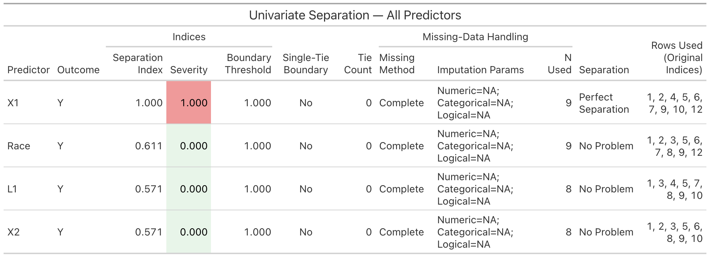

# DISCO
**DI**agnosis of **S**eparation and **C**orrection of **O**dds-ratio inflation in logistic regression

> Fast diagnostics for **perfect** and **quasi-complete** separation in binary outcomes, with clear severity scoring, per-subset missing-data handling, and pretty `gt` tables — plus severity-adaptive and MEP-regularized Bayesian estimators.

---

## Why separation matters
When predictors **perfectly** (or quasi-completely) split the outcome, logistic regression can produce **infinite** (or severely inflated) odds ratios and unstable inference. **DISCO** helps you **detect** these cases early and **stabilize** estimates with Bayesian priors.

---

## Overview

### Separation Diagnosis
- `uni_separation()` — univariate detector using:
  - Hungarian matching to align clusters,
  - a **vectorized Rand index**,
  - a **non-negative boundary threshold** to guard against boundary ties,
  - a **continuous severity score** in [0,1].
- `latent_separation()` — multivariate detector using **LP-based** feasibility with options to:
  - search for **inclusion-minimal** separating subsets (pruning),
  - choose **perfect**, **quasi**, or **either** as “hit” criteria,
  - handle missingness **per subset** (complete-case or imputation).

### Estimation (Bayesian)
- `EP_univariable()` — DISCO-severity-adaptive **univariate** logistic regression with an **MEP** prior; shared missing handling (applied once), standardized X for **severity & fit**, optional back-transforms (logit / SAS / Long), and a GLM comparator on standardized X.
- `MEP_latent()` — **unified latent** (numeric **+ factor** support via `model.matrix`): handles missingness **once** on raw `y, X`, encodes factors (treatment; baseline = first level), **safe-scales encoded columns**, runs a small grid over \((\mu, \sigma_{\text{global}}, \kappa)\), and selects one run via acceptance-window + GLM-ratio closeness + posterior predictive agreement. Reports working-scale summaries **with CIs** and back-transformed **b_A / b_SAS / b_Long** **(per encoded column)** with CIs.
- `MEP_mixture()` — **severity-anchored multi-predictor** logistic with **numeric + factor** predictors. Encodes factors via `model.matrix(~ ., data = X)`, anchors slope prior scales by **per-predictor DISCO severities** (numeric severities computed on z-scores; factors unchanged for severity step), runs a small grid (intercept mean offsets, global slope multipliers, κ), and selects one run via acceptance window + checks. Reports posterior **means** on the standardized scale and optional back-transformed **A / SAS / Long** **means** per encoded column.

---

## Installation

```r
# install.packages("devtools")
devtools::install_github("bioscinema/DISCO")
library(DISCO)
```

---

## Separation Diagnosis

### Quick Start

```r
library(DISCO)

#### I. Univariate: quick diagnostic #############
df <- data.frame(Y = c(0,1,0,1), X = c(-2, 2, -1, 1))
res <- uni_separation(df, predictor = "X", outcome = "Y", missing = "complete")
res$separation_type     # "Perfect separation" | "Quasi-complete separation" | "No separation problem"
res$severity_score      # in [0,1]
res$boundary_threshold  # data-driven non-negative threshold
res$missing_info        # method, params, rows_used, n_used

#### II. Latent (multivariate): LP-based check ####
y <- c(0,0,0,0,1,1,1,1)
X <- cbind(
  X1 = c(-1.86, -0.81, 1.32, -0.40, 0.91, 2.49, 0.34, 0.25),
  X2 = c( 0.52,  1.07, 0.60,  0.67,-1.39, 0.16,-1.40,-0.09)
)
lat <- latent_separation(y, X, missing = "complete")  # scale_X = FALSE by default
lat$type           # "Perfect separation" | "Quasi-complete separation" | "No separation problem"
lat$message        # human-readable summary
lat$removed        # for quasi: variables whose removal yields perfect (else NULL)
lat$missing_info   # method, params, rows_used, n_used

# Optional: enable z-score scaling of the encoded predictors
lat_scaled <- latent_separation(y, X, missing = "complete", scale_X = TRUE)

# Search for inclusion-minimal separating subsets (pruned search)
lat_min <- latent_separation(
  y, X,
  find_minimal   = TRUE,
  min_vars       = 2,              # smallest subset size to consider
  max_vars       = ncol(X),        # largest subset size (default is all)
  stop_at_first  = FALSE
)
names(lat_min$minimal_subsets)     # e.g., "X1", "X2", "X1_X2"
one <- lat_min$minimal_subsets[[1]]
one$type          # "Perfect separation" or "Quasi-complete separation"
one$vars          # variables in the subset
one$removed       # for quasi-only; variables whose removal yields perfect
one$missing_info  # rows used, etc.
```

### Missing-Data Handling

- `missing = "complete"`: drop rows with **NA** in the tested variables; the **outcome is never imputed**.
- `missing = "impute"`: **impute predictors only**; outcome NAs are **always dropped**.
- Every result returns `missing_info` with: `method`, `params`, `n_used`, and the exact `rows_used` (original indices).
- In latent (subset) searches, **each subset** has its own `missing_info` since missingness can differ by variable combination.

#### Imputation Params (`missing_info$params`)
A compact summary of per-type rules when `method = "impute"` (e.g., `Numeric=Mean; Categorical=Missing; Logical=Mode`):

- **Numeric** (`numeric_method`)
  - `Mean` — replace `NA` with the column mean  
  - `Median` — replace `NA` with the column median  
  - `Constant=<c>` — replace `NA` with a supplied constant (e.g., `Constant=0`)  
  - `Custom Imputer` — a user-provided function was used

- **Categorical** (`categorical_method`)
  - `Missing` — turn `NA` into an explicit `"Missing"` level (adds a level if needed)  
  - `Mode` — replace `NA` with the most frequent level  
  - `Constant=<level>` — replace `NA` with a supplied level  
  - `Custom Imputer` — a user-provided function was used

- **Logical** (`logical_method`)
  - `Mode` — replace `NA` with the most frequent value (`TRUE`/`FALSE`)  
  - `Constant=TRUE/FALSE` — replace `NA` with the given logical  
  - `Custom Imputer` — a user-provided function was used

**Mode definition.** *Mode* is the value/level occurring **most often** among non-missing entries. If there’s a tie, it is broken **deterministically** (e.g., first level / first in `table()` order).

Example with missing values:

```r
set.seed(2025)
df_miss <- data.frame(
  Y    = c(0,0,0,0,1,1,1,1, 0,1, NA, 1),
  X1   = c(0.5, 1.0, NA, 2.0, 5.0, 6.0, 7.0, NA, 1.5, 8.0, 9.0, 6.5),
  X2   = c(10, 9, 8, NA, 6, 5, NA, 3, 2, 1, 0, NA),
  Race = factor(c("A","A","B", NA, "C","C","B","A","B", NA, "C","A")),
  L1   = c(TRUE, NA, FALSE, TRUE, TRUE, NA, FALSE, TRUE, FALSE, TRUE, TRUE, NA)
)

# Complete-case
res_cc <- uni_separation(df_miss, "X1", "Y", missing = "complete")
res_cc$missing_info

# Impute (defaults = numeric median, categorical mode, logical mode)
res_imp <- uni_separation(df_miss, "X1", "Y", missing = "impute")
res_imp$missing_info

# Treat NA as a level for categorical predictors
res_cat <- uni_separation(
  df_miss, "Race", "Y", missing = "impute",
  impute_args = list(categorical_method = "missing")
)
res_cat$missing_info$params
```

### Pretty tables (`gt`) — optional

```r
# install.packages("gt")
library(gt)

# One predictor
res_uni_cc <- uni_separation(df_miss, "X1", "Y", missing = "complete")
gt_uni_separation(res_uni_cc, title = "Univariate (X1 vs Y) — Complete-case")

# All predictors vs outcome (one-shot summary)
gt_uni_separation_all(df_miss, outcome = "Y", missing = "complete")
```

#### Example output



> This table summarizes univariate screen results of each predictor against the outcome (`Y`) using **complete-case** data. It flags whether any single predictor causes separation in a logistic model. See the README earlier version for column definitions: Separation Index, Severity, Boundary Threshold, Single-Tie Boundary, Tie Count, Missing-Data Handling block, Separation label, and Rows Used (Original Indices).

```r
# Latent minimal subsets (imputed)
res_lat_imp <- latent_separation(
  y = df_miss$Y,
  X = df_miss[, c("X1","X2","Race","L1")],
  find_minimal = TRUE,
  missing = "impute",
  impute_args = list(numeric_method = "mean", categorical_method = "missing", logical_method = "mode")
)
gt_latent_separation(res_lat_imp, title = "Latent Minimal Subsets — Imputed")
```


> Summarizes subsets of predictors that yield separation in a **complete-case analysis**. See the original table notes for interpretation of “Removed And Rest Reach Perfect”, “Rows Used (Original Indices)”, etc.

---

## Severity-adaptive Univariate Bayes — `EP_univariable`

`EP_univariable()` fits **intercept + one predictor** logistic regression with a **severity-adaptive MEP prior** informed by `uni_separation()`. It uses a random-walk MH sampler with light auto-tuning.

**Shared missing handling (applied once).** We apply `missing` to `(outcome, predictor)` **once**, then use those rows/values for both the DISCO severity and the model fit. For the DISCO call we pass `missing = "complete"` because the data are already prepared. Numeric predictors are z-scored for severity, GLM comparator, and the Bayesian fit; 2-level factors are converted to 0/1 for estimation/comparator (error if >2 levels).

**Defaults (match SLURM script):**
- `n_iter = 20000`, `burn_in = 5000`
- Proposal s.d. blend: `step = 0.30*(1-severity) + 0.12*severity`
- Prior scales: `sigma0 = 10`, `sigma1_hi = 5`, `sigma1_lo = 0.15`
- Shape blend: `kappa = 1 + severity*(2.5 - 1)`
- `ci_level = 0.95`, MH auto-tuning during burn-in (`tune_threshold_hi = 0.45`, `tune_threshold_lo = 0.20`, `tune_interval = 500`)
- `compare = TRUE` fits a GLM comparator on standardized X

**Output**
- `posterior`: summaries for **standardized** `beta0`, `beta1`; if `transform_beta1 ∈ {logit, SAS, Long}`, also includes `beta0_orig` and the corresponding slope (`beta1_logit` / `beta1_SAS` / `beta1_Long`) on the **original predictor** scale.
- `disco`: severity metadata (`separation_type`, `severity_score`, `boundary_threshold`, `single_tie_boundary`, `missing_info` including `rows_used`).
- `prior`, `mcmc` diagnostics, `comparators$glm` (coefficients on standardized X), `rows_used`. If `return_draws = TRUE`, returns `draws$chain_std` / `draws$chain_orig`.

### Quick start

```r
set.seed(1)
n  <- 60
x  <- rnorm(n, mean = 0.3, sd = 1)
eta <- -0.2 + 1.0 * x
y  <- rbinom(n, size = 1, prob = plogis(eta))
df <- data.frame(y = y, x = x)

# (1) Default: STANDARDIZED beta0, beta1
fit_std <- EP_univariable(df, predictor = "x", outcome = "y",
                          n_iter = 6000, burn_in = 2000, seed = 42)
fit_std$posterior

# (2) Back-transform slope to ORIGINAL-x units on LOGIT scale
fit_logit <- EP_univariable(df, "x", "y",
                            transform_beta1 = "logit",
                            n_iter = 6000, burn_in = 2000, seed = 42)
fit_logit$posterior

# (3) Alternative effect scales on ORIGINAL-x units
fit_sas  <- EP_univariable(df, "x", "y", transform_beta1 = "SAS",
                           n_iter = 6000, burn_in = 2000, seed = 42)
fit_long <- EP_univariable(df, "x", "y", transform_beta1 = "Long",
                           n_iter = 6000, burn_in = 2000, seed = 42)

# (4) Shared missing handling
df2 <- df; df2$x[c(5, 8)] <- NA
fit_cc <- EP_univariable(df2, "x", "y", missing = "complete",
                         n_iter = 4000, burn_in = 1500, seed = 9)
fit_im <- EP_univariable(df2, "x", "y", missing = "impute",
                         impute_args = list(numeric_method = "median"),
                         n_iter = 4000, burn_in = 1500, seed = 9)
```

**Interpretation**
- `beta1` (default) — change in log-odds per **1 SD** increase in X (standardized scale).
- `beta1_logit` — change in log-odds per **1 unit** increase in original X.
- `beta1_SAS = beta1_logit * (π/√3)`; `beta1_Long = beta1_logit * (π/√3 + 1)`.
- `beta0_orig` aligns the intercept with original X-units.

---

## Bayesian Estimation (multivariate) — CIs & means

### Core sampler (fixed prior): `mep_function()`

```r
set.seed(1)
y <- c(0,0,0,0,1,1,1,1)
X <- cbind(
  X1 = c(-1.86, -0.81,  1.32, -0.40,  0.91,  2.49,  0.34,  0.25),
  X2 = c( 0.52, -0.07,  0.60,  0.67, -1.39,  0.16, -1.40, -0.09)
)
p <- ncol(X) + 1
fit <- mep_function(
  n_iter = 10000, burn_in = 1000, init_beta = rep(0.01, p), step_size = 0.4,
  X_orig = X, y = y, mu = rep(0, p), Sigma = diag(p), kappa = 1,
  scale_X = TRUE, ci_level = 0.95
)
head(fit$scaled_summary)         # working/logit space with CIs
head(fit$standardized_coefs_back) # A / SAS / Long with CIs
```

> Note: Output includes **Scaled / A / SAS / Long**; no “M” scale.

---

## Unified latent MEP — `MEP_latent()`

Fits a logistic model with a **Multivariate Exponential Power (MEP)** prior via RW–MH and performs a small grid search over prior settings \((\mu, \Sigma, \kappa)\). Predictors are **always z-scored internally** (safe-scaling). Summaries and CIs are reported on the working (logit/standardized) scale and **back-transformed to the original (encoded) predictor scale**.

**What it does**
- Handles missingness **once** (complete-case or imputation) on the **raw** `X` and `y`, then uses the same rows for both fitting and the GLM reference.
- **Encodes factors** in `X` with `model.matrix(~ ., data = X)` (treatment contrasts, baseline = first level), drops the intercept, and fits on the **numeric encoded** design.
- Standardizes encoded predictors with a **safe scaler** (sd set to 1 when sd=0 or non-finite).
- For each grid setting, runs RW–MH with an EP prior and collects posterior **means**, **credible intervals**, and a posterior predictive **match** statistic.
- **Selects one run** by: (i) acceptance-rate window, (ii) closeness to a **GLM coefficient-ratio** reference (same standardized working scale), and (iii) posterior predictive agreement.

**Factor handling & encoded names**
- **Numeric predictors** appear as a single encoded column with their original name (e.g., `X3`).
- **Factors** expand to treatment-contrast dummies (baseline = first level). For a 2-level factor `G` with levels `A` (baseline) and `B`, the encoded column is `GB` (effect **B vs A**). Change the baseline beforehand with `stats::relevel()`.
- All reported effects are **per encoded column**.

**Back-transforms (encoded scale)**
- Let \(s_x\) be the SD of an encoded column (numeric or 0/1 dummy) on the encoded `X` scale, and \(\beta_\text{std}\) the slope in the standardized design. We report:
  - `b_A_original  = β_std / s_x` (per-unit effect on encoded scale),
  - `b_SAS_original  = b_A_original * π/√3`,
  - `b_Long_original = b_A_original * (π/√3 + 1)`.
  For a 0/1 dummy with prevalence \(p\), \(s_x = \sqrt{p(1-p)}\).

**Returns** (selected run)
- `best_settings` (`mu`, `Sigma_diag`, `kappa`), `best_acceptance`, `best_prop_matched`.
- `scaled_summary` (includes Intercept) with `Mean`, `SD`, `CI_low`, `CI_high` on the working scale.
- `standardized_coefs_back` with **means & CIs** for `Scaled` plus **`b_A_original`**, **`b_SAS_original`**, **`b_Long_original`** **per encoded column**.

**Examples**

```r
## Numeric example
y <- c(0,0,0,0, 1,1,1,1)
X <- data.frame(
  X1 = c(-1.86, -0.81,  1.32, -0.40,  0.91,  2.49,  0.34,  0.25),
  X2 = c( 0.52,  -0.07,  0.60,  0.67, -1.39,  0.16, -1.40, -0.09)
)

fit_cc <- MEP_latent(
  y = y, X = X,
  n_iter = 10000, burn_in = 1000, step_size = 0.4,
  mu_vals = seq(-1, 1, by = 0.2),
  sigma0_intercept = 10,
  sigma_global_multipliers = c(0.1, 0.5, 1, 2, 5),
  kappa_vals = c(0.5, 1, 2),
  missing = "complete",
  ci_level = 0.95, seed = 42
)
fit_cc$best_settings
head(fit_cc$scaled_summary)
head(fit_cc$standardized_coefs_back)

## Factor example (treatment coding; baseline = first level)
Xf <- data.frame(
  X1 = X$X1,
  G  = factor(c("A","A","B","B","A","B","A","B"), levels = c("A","B"))
)
fit_f <- MEP_latent(
  y = y, X = Xf,
  n_iter = 8000, burn_in = 800,
  mu_vals = seq(-0.5, 0.5, by = 0.25),
  sigma_global_multipliers = c(0.5, 1, 2),
  kappa_vals = c(1, 2),
  missing = "complete", seed = 99
)
fit_f$standardized_coefs_back     # contains column "GB" (= B vs A)

## Impute: add an NA to a factor and a numeric column
Xfi <- Xf; Xfi$X1[1] <- NA; Xfi$G[4] <- NA
fit_i <- MEP_latent(
  y = y, X = Xfi,
  n_iter = 6000, burn_in = 600,
  mu_vals = seq(-0.5, 0.5, by = 0.25),
  sigma_global_multipliers = c(0.5, 1, 2),
  kappa_vals = c(1, 2),
  missing = "impute",
  impute_args = list(numeric_method = "median", factor_method = "mode"),
  seed = 77
)
fit_i$rows_used
head(fit_i$scaled_summary)
```

---

## Severity-Adaptive MEP for Mixtures — `MEP_mixture()` 

- Encodes `X` via `model.matrix(~ ., data = X)` (intercept dropped for slopes).
- For each **original** predictor (before encoding), computes a **DISCO severity** (on modeling rows). **Numeric predictors are z-scored** for the severity computation (factors unchanged).
- Maps severity \\( s \\in [0,1] \\) to an **anchor slope prior sd** and **κ** (intercept uses a wide prior).
- Runs a small grid: **intercept mean offsets**, **global multiplier** on slope prior sds, and **κ** around the anchor average; chooses one run using an **acceptance window**, **posterior predictive agreement**, and (when available) **GLM ratio** closeness relative to a single **reference** predictor.
- Returns posterior **means and CIs** for standardized slopes and, if requested, back-transforms (**logit / SAS / Long**) **means and CIs** per **encoded** column.

**Factor handling & labels**
- Treatment contrasts with the **first level as baseline**.
- Two-level factor `X3` with levels `A` (baseline) and `B` yields dummy **`X3B`** (=1 for B, 0 for A). Its coefficient is **B vs A** (controlling for other predictors).
- Change baseline before calling to alter dummy labels:
  ```r
  X$X3 <- stats::relevel(X$X3, ref = "B")
  ```


**Example**
```r
y <- c(0,0,0,0, 1,1,1,1)
X <- data.frame(
  X1 = c(-1.86,-0.81, 1.32,-0.40, 0.91, 2.49, 0.34, 0.25),
  X2 = c( 0.52,-0.07, 0.60, 0.67,-1.39, 0.16,-1.40,-0.09),
  X3 = factor(c(rep("A",4), rep("B",4)))
)

fit <- MEP_mixture(
  y, X,
  n_iter_grid = 4000, burn_in_grid = 1000, step_size = 0.40,
  sigma_hi = 5, sigma_lo = 0.15,
  kappa_min = 1, kappa_max = 2.5,
  sigma_global_multipliers = c(0.1, 0.5, 1, 2, 5, 10),
  accept_window = c(0.30, 0.40),
  accept_target = 0.35,
  transform_back = "logit",
  ci_level = 0.95,
  seed = 9
)

fit$ref_predictor       # chosen reference (original predictor index/name)
fit$posterior$effects   # Scaled + CI + (b_logit/SAS/Long)_original + CI columns
```

**Notes**
- Standardization/back-transforms use **unscaled encoded** column SDs; for a 0/1 dummy with prevalence \\(p\\), SD is \\(\\sqrt{p(1-p)}\\).
- The **reference predictor** for ratios comes from original `X` (default = highest severity). If a factor, the denominator is its **first dummy**.
- Naming note: `MEP_latent()` reports `b_A_*` for the per-unit (logit) effect; `MEP_mixture()` uses `b_logit_*`. These are equivalent (A ≡ logit).

---

## API cheatsheet
```r
# Univariate Detection
uni_separation(
  data, predictor, outcome = "Y",
  missing = c("complete","impute"),
  impute_args = list(
    numeric_method     = c("median","mean"),
    categorical_method = c("mode","missing"),
    logical_method     = c("mode","missing"),
    custom_fn          = NULL
  )
)

# Latent (multivariate) Detection
latent_separation(
  y, X,
  find_minimal = FALSE,
  test_combinations = FALSE,
  min_vars = 2, max_vars = NULL,
  mode = c("either","perfect","quasi"),
  stop_at_first = FALSE,
  missing = c("complete","impute"),
  impute_args = list(...),
  scale_X = FALSE     # set TRUE to z-score encoded predictors
)

# Severity-adaptive Univariate Bayes
EP_univariable(
  data, predictor, outcome = "y",
  missing = c("complete","impute"), impute_args = list(
    numeric_method = c("median","mean"),
    factor_method  = c("mode")
  ),
  n_iter = 20000, burn_in = 5000,
  step_hi = 0.30, step_lo = 0.12,
  ci_level = 0.95, compare = TRUE,
  return_draws = FALSE, seed = NULL,
  transform_beta1 = c("none","logit","SAS","Long"),
  sigma0 = 10, sigma1_hi = 5, sigma1_lo = 0.15,
  kappa_min = 1, kappa_max = 2.5,
  tune_threshold_hi = 0.45, tune_threshold_lo = 0.20, tune_interval = 500
)

# Unified latent
MEP_latent(
  y, X,
  missing = c("complete","impute"),
  impute_args = list(),
  n_iter = 10000, burn_in = 1000, step_size = 0.4,
  mu_vals = seq(-1, 1, by = 0.1),
  sigma0_intercept = 10,
  sigma_global_multipliers = c(0.1, 0.5, 1, 2, 5, 10),
  kappa_vals = c(0.5, 1, 2),
  accept_window = c(0.3, 0.4), accept_target = 0.35,
  ci_level = 0.95, ppc_threshold = 0.80,
  tune_threshold_hi = 0.45, tune_threshold_lo = 0.20, tune_interval = 500,
  verbose = FALSE, seed = NULL
)

# Hybrid Situation
MEP_mixture(
  y, X,
  missing = c("complete","impute"),
  impute_args = list(),
  n_iter_grid = 10000, burn_in_grid = 1000,
  step_size = 0.40,
  mu_intercept_offsets = seq(-1, 1, by = 0.2),
  sigma0_intercept = 10,
  sigma_global_multipliers = c(0.1, 0.5, 1, 2, 5, 10),
  sigma_hi = 5, sigma_lo = 0.15,
  kappa_min = 1, kappa_max = 2.5,
  kappa_delta = seq(-0.5, 0.5, by = 0.2),
  accept_window = c(0.30, 0.40), accept_target = 0.35,
  ref = NULL, transform_back = c("none","logit","SAS","Long"),
  seed = NULL, return_draws = FALSE
)
```

### Notes & assumptions
- Outcome is binary and will be normalized to `{0,1}` (supports logical or 2-level factor/character).
- Categorical predictors are handled directly (univariate) or via dummy encoding (latent / mixture).
- **MEP_latent** and **MEP_mixture** outputs are per **encoded** column (e.g., `FactorLevel` dummies) **with CIs**.
- Change baselines with `stats::relevel()` to alter dummy interpretation.
- Testing covers: univariate & latent separation cases, minimal-subset search, and missingness modes (complete-case vs imputation). Use:
  ```r
  devtools::test()
  # or
  testthat::test_dir("tests/testthat")
  ```
