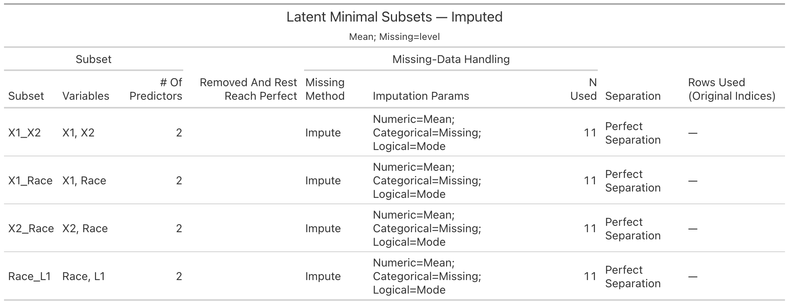

# DISCO
**DI**agnosis of **S**eparation and **C**orrection of **O**dds-ratio inflation in logistic regression

> Fast diagnostics for **perfect** and **quasi-complete** separation in binary outcomes, with clear severity scoring, per-subset missing-data handling, and pretty `gt` tables.

---

## Why separation matters
When predictors **perfectly** (or almost perfectly) split the outcome, logistic regression can produce **infinite** (or severely inflated) odds ratios and unstable inference. **DISCO** helps you **detect** these cases early and (soon) **correct** estimates.

---

## Overview

### Separation Diagnosis
- `uni_separation()` — univariate detector using:
  - Hungarian matching to align clusters,
  - a **vectorized Rand index**,
  - a **non-negative boundary threshold** to guard against boundary ties,
  - a **continuous severity score** in \[0,1\].
- `latent_separation()` — multivariate detector using **LP-based** feasibility with options to:
  - search for **inclusion-minimal** separating subsets (pruning),
  - choose **perfect**, **quasi**, or **either** as “hit” criteria,
  - handle missingness **per subset** (complete-case or imputation).

### Estimation Correction
Planned: odds-ratio deflation after separation detection. *(Coming soon.)*

---

## Installation

```r
# install.packages("devtools")
devtools::install_github("bioscinema/DISCO")
library(DISCO)
```

## Separation Diagnosis
### Quick Start

```r
library(DISCO)

# Univariate: quick diagnostic
df <- data.frame(Y = c(0,1,0,1), X = c(-2, 2, -1, 1))
res <- uni_separation(df, predictor = "X", outcome = "Y", missing = "complete")
res$separation_type     # "Perfect separation" | "Quasi-complete separation" | "No separation problem"
res$severity_score      # in [0,1]
res$boundary_threshold  # data-driven non-negative threshold
res$missing_info        # method, params, rows_used, n_used

# Latent (multivariate): LP-based check
y <- c(0,0,0,0,1,1,1,1)
X <- cbind(
  X1 = c(-1.86, -0.81, 1.32, -0.40, 0.91, 2.49, 0.34, 0.25),
  X2 = c( 0.52,  1.07, 0.60,  0.67,-1.39, 0.16,-1.40,-0.09)
)
latent_separation(y, X)$type  # "perfect separation" (for this example)
```

### Missing-Data Handling

- `missing = "complete"`: drop rows with **NA** in the tested variables; the **outcome is never imputed**.
- `missing = "impute"`: **impute predictors only**; outcome NAs are **always dropped**.
- Every result returns `missing_info` with:
  - `method` (`"complete"` or `"impute"`)
  - `params` (imputation settings or `custom_fn`)
  - `n_used` (number of rows analyzed)
  - `rows_used` (exact original row indices)
- In latent (subset) searches, **each subset** has its own `missing_info` (its own `rows_used`/`n_used`) since missingness can differ by variable combination.

Example with missing values:

```r
set.seed(2025)
df_miss <- data.frame(
  Y    = c(0,0,0,0,1,1,1,1, 0,1, NA, 1),
  X1   = c(0.5, 1.0, NA, 2.0, 5.0, 6.0, 7.0, NA, 1.5, 8.0, 9.0, 6.5),
  X2   = c(10, 9, 8, NA, 6, 5, NA, 3, 2, 1, 0, NA),
  Race = factor(c("A","A","B", NA, "C","C","B","A","B", NA, "C","A")),
  L1   = c(TRUE, NA, FALSE, TRUE, TRUE, NA, FALSE, TRUE, FALSE, TRUE, TRUE, NA)
)

# Complete-case
res_cc <- uni_separation(df_miss, "X1", "Y", missing = "complete")
res_cc$missing_info

# Impute (defaults = numeric median, categorical mode, logical mode)
res_imp <- uni_separation(df_miss, "X1", "Y", missing = "impute")
res_imp$missing_info

# Treat NA as a level for categorical predictors
res_cat <- uni_separation(
  df_miss, "Race", "Y", missing = "impute",
  impute_args = list(categorical_method = "missing")
)
res_cat$missing_info$params
```

### Pretty tables (gt) — optional

```r
# install.packages("gt")
library(gt)

# One predictor
res_uni_cc <- uni_separation(df_miss, "X1", "Y", missing = "complete")
gt_uni_separation(res_uni_cc, title = "Univariate (X1 vs Y) — Complete-case")

# All predictors vs outcome (one-shot summary)
gt_uni_separation_all(df_miss, outcome = "Y", missing = "complete")
```

### Example output


```r
# Latent: minimal subsets, complete-case per subset
res_lat_cc <- latent_separation(
  y = df$Y,
  X = df[, c("X1","X2","Race","L1")],
  find_minimal = TRUE,
  missing = "complete"
)
```


```r
# Latent minimal subsets (imputed)
res_lat_imp <- latent_separation(
  y = df_miss$Y,
  X = df_miss[, c("X1","X2","Race","L1")],
  find_minimal = TRUE,
  missing = "impute",
  impute_args = list(numeric_method = "mean", categorical_method = "missing", logical_method = "mode")
)
gt_latent_separation(res_lat_imp, title = "Latent Minimal Subsets — Imputed")
```


Tables colorize severity, display missing-data method & params, and list Rows Used.
If all subjects are used, the full 1, 2, …, N is printed automatically.

### API cheatsheet
```r
# Univariate
uni_separation(
  data, predictor, outcome = "Y",
  missing = c("complete","impute"),
  impute_args = list(
    numeric_method     = c("median","mean"),
    categorical_method = c("mode","missing"),
    logical_method     = c("mode","missing"),
    custom_fn          = NULL
  )
)

# Latent (multivariate)
latent_separation(
  y, X,
  find_minimal = FALSE,
  test_combinations = FALSE,
  min_vars = 2, max_vars = NULL,
  mode = c("either","perfect","quasi"),
  stop_at_first = FALSE,
  missing = c("complete","impute"),
  impute_args = list(...)
)

# Tables (optional)
gt_uni_separation(res, title = NULL, subtitle = NULL, show_rows_used = FALSE)
gt_latent_separation(res, title = NULL, subtitle = NULL, show_rows_used = FALSE)
gt_uni_separation_all(
  data, outcome = "Y", predictors = NULL,
  missing = c("complete","impute"),
  impute_args = list(...),
  include_constant = FALSE, only_hits = FALSE
)
```r

### Notes & assumptions
- Outcome is binary and will be normalized to '{0,1}' (supports logical or 2-level factor/character).
- Categorical predictors are handled directly (univariate) or via dummy encoding (latent).
- The **severity score** scales the Rand index above a data-driven, non-negative boundary and penalizes single-tie inflation.


### Testing

The package includes unit tests covering:
- Univariate: no separation / perfect / quasi (numeric & categorical).
- Latent: no separation / perfect / quasi; minimal-subset search.
- Missingness: complete-case vs imputation (and custom imputer); rows_used/n_used always reported.

Run tests:
```r
devtools::test()
# or
testthat::test_dir("tests/testthat")
```

## Roadmap
Estimation correction: odds-ratio deflation after detection (coming soon).

